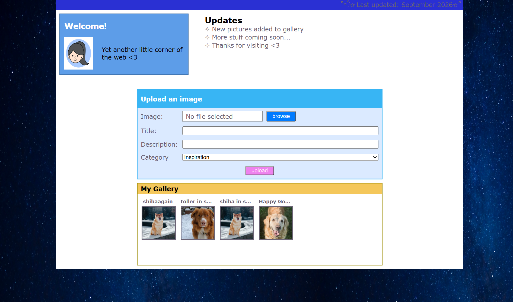

# MyMillennium
MyMillennium is a full-stack web application inspired by MySpace and similar early-2000s websites. The project is a hobby project focused primarily on backend development, system integrations and Azure services, while still providing a user-friendly experience.

## Features
- Upload images with title, description and category
- Browse uploaded images in a gallery
- Generate thumbnails asynchronously after image upload
- Display generated thumbnails in the gallery
- Display the original image when a thumbnail is selected

## Technologies
### Backend
- C# / .NET
- ASP.NET Core Web API
- Entity Framework Core / LINQ
- SQL Server

### Azure services
- Azure Blob Storage
- Azure Service Bus
- Azure Functions

### Frontend
- React
- TypeScript
- CSS

### Development and testing
- Postman

> Sensitive configuration and connection strings are kept outside source control using .NET User Secrets for the API and local Azure Functions configuration.


## Data Flows
### Image upload and processing
```text
React Client
  │
  │ POST /api/Art/upload
  │ (image + metadata)
  ▼
ASP.NET Core Web API
  │
  ├──► SQL Server
  │      (Store image metadata)
  │
  ├──► Azure Blob Storage
  │      (Store original image)
  │
  └──► Azure Service Bus
         (Put ProcessArtImage message in queue)
               │
               ▼
         Azure Function
               │
               ├──► Azure Blob Storage
               │      (Read original image + store thumbnail)
               │
               └──► SQL Server
                      (Update thumbnail location + processing status)
```
When an image is uploaded, an HTTP request is sent to the API, which stores the original image in Azure Blob Storage and persists its metadata in SQL Server.
A `ProcessArtImage` message is then sent to the Azure Service Bus queue. A Service Bus-triggered Azure Function consumes the message, retrieves the original image from Blob Storage and generates a thumbnail. The thumbnail is stored in Blob Storage, and the corresponding database record is updated with the thumbnail location and processing status.


### Gallery
```text
React Client
  │
  │ `GET /api/Art/getImages`
  ▼
ASP.NET Core Web API
  │
  ├──► SQL Server
  │     (Retrieve image metadata)
  │
  └─── Azure Blob Storage
        (Create SAS URLs for blobs)
  │
  │ Return metadata + SAS URLs
  ▼
React Client
  │
  └──► Azure Blob Storage
        (Read images using SAS URLs)

```
The API retrieves the image metadata from SQL Server and generates time-limited SAS URLs that allow the React client to read the corresponding images stored in the private Blob Storage container. The React client displays the generated thumbnails in the gallery and uses the original image SAS URL when a thumbnail is selected.

## User Interface


## Credits
- Profile illustration: [Female Vectors by Vecteezy](https://www.vecteezy.com/free-vector/female)

- Space background: Photo by [Joshua Woroniecki](https://unsplash.com/@joshuaworoniecki) on [Unsplash](https://unsplash.com/photos/blue-sky-with-stars-during-night-time-TspYRqQrErc).
