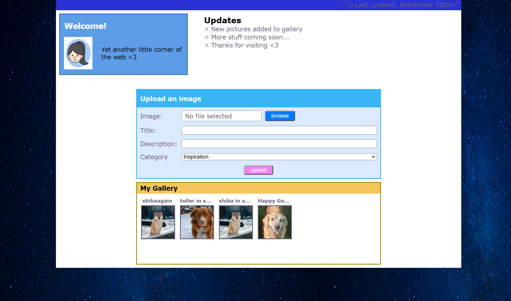

# MyMillennium
MyMillennium is a full-stack web application inspired by MySpace and similar early-2000s websites. The project is a hobby project focused primarily on backend development, system integrations and Azure services, while still providing a user-friendly experience.

## Technologies
Backend
- C# / .NET
- ASP.NET Core Web API
- Entity Framework Core / LINQ
- SQL Server

Azure services
- Azure Blob Storage
- Azure Service Bus
- Azure Functions

Frontend
- React
- TypeScript
- CSS


## Data Flows
### Image upload and processing
```text
React Client
  │
  │ POST /api/Art/upload
  │ (image + metadata)
  ▼
ASP.NET Core Web API
  │
  ├──► Azure Blob Storage
  │      └─ Store original image
  │
  └──► SQL Server
         └─ (Transaction)
              ├─ Store ArtItem metadata
              └─ Store OutboxMessage


Outbox Processing Worker
  │
  ├──► SQL Server
  │      ├─ Poll for unprocessed outbox messages
  │      └─ Mark published messages as processed
  │
  └──► Azure Service Bus
         └─ Publish ProcessArtImage message
                   │
                   │ triggers
                   │
                   ▼
               Azure Function
                   │
                   ├──► Azure Blob Storage
                   │      └─ Read original image + store thumbnail
                   │
                   └──► SQL Server
                          └─ Update thumbnail location + processing status
```
When an image is uploaded, the API stores the original image in Blob Storage. An `ArtItem` containing image metadata is stored together with a corresponding `OutboxMessage` in the same database transaction, following the Transactional Outbox Pattern.

A background worker polls every two seconds for unprocessed outbox messages. When one is found, the worker attempts to publish a `ProcessArtImage` message to Service Bus. After successful publishing, the outbox message is marked as processed in the database.

A Service Bus-triggered Azure Function consumes the `ProcessArtImage` message, retrieves the original image from Blob Storage, and generates a thumbnail. The thumbnail is stored in Blob Storage, and the corresponding `ArtItem` is updated with the thumbnail location and processing status `Completed`.


### Gallery
```text
React Client
  │
  │ GET /api/Art/getImages
  ▼
ASP.NET Core Web API
  │
  ├──► SQL Server
  │      └─ Retrieve image metadata
  │
  └──► Azure Blob Storage
         └─ Create SAS URLs for blobs
  │
  │ Return metadata + SAS URLs
  ▼
React Client
  │
  └──► Azure Blob Storage
         └─ Read images using SAS URLs
```
The API retrieves the image metadata from SQL Server and generates time-limited SAS URLs that allow the React client to read the corresponding images stored in the private Blob Storage container. The React client displays the generated thumbnails in the gallery and uses the original image SAS URL when a thumbnail is selected.

## Features
- Upload images with title, description and category
- Browse uploaded images in a gallery
- Generate thumbnails asynchronously after image upload
- Display generated thumbnails in the gallery
- Display the original image when a thumbnail is selected

## User Interface


## Development & Testing
- NUnit
- Postman

> Sensitive configuration and connection strings are kept outside source control using .NET User Secrets for the API and local Azure Functions configuration.

## In Progress
- Expand test coverage
- Add a music player
- Improve responsive layout for mobile

## Credits
- Profile illustration: [Female Vectors by Vecteezy](https://www.vecteezy.com/free-vector/female)

- Space background: Photo by [Joshua Woroniecki](https://unsplash.com/@joshuaworoniecki) on [Unsplash](https://unsplash.com/photos/blue-sky-with-stars-during-night-time-TspYRqQrErc).
